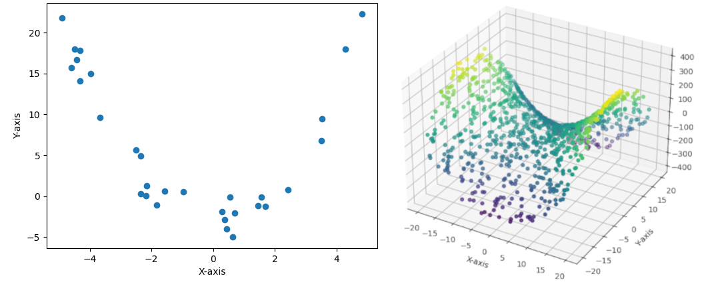

# data-generator
A python script that allows for a quick generation of dummy datasets for algorithm visualisation and the evaluation of the functionality of an implementation.

## Clusters

2D clusters can be generated by using the *create_clusters_2D* function of *ClusterGenerator*. 3D clusters can be generated using the *create_clusters_3D* function of *ClusterGenerator*. The functions expect the following parameters:
| **Parameter** | Description|
|------------------|-----------------------------------------------------------------------------------------------------------------------|
| **num_clusters** | The number of clusters to be generated                                                                                |
| **range_x**      | A tuple that defines the range in which the center of a cluster can be located on the X-axis.                         |
| **range_y**      | A tuple that defines the range in which the center of a cluster can be located on the Y-axis                          |
| **range_z**      | A tuple that defines the range in whi*ch the center of a cluster can be located on the z-axis (only 3D clusters)       |
| **range_points** | A tuple that defines the minimum and maximum amount of points that are generated for a cluster                        |
| **max_distance** | The Maximums distance in both dimensions a datapoint can have relative to the center of the cluster it is assigned to |
| **seed**         | (optional) seeds the generation process to be reproducible. Defaults to 42                                            |

## Function Data

Datapoints can also be generated from a given function taking 1 numerical argument for 2D datapoints or 2 numerical arguments for 3D datapoints. To achieve this, the methods *create_data_2d* and *create_data_3d* of *FunctionGenerator* are used. The methods expect the following parameters:
| Parameter      | Description                                                                                                                                         |
|----------------|-----------------------------------------------------------------------------------------------------------------------------------------------------|
| function       | A function that takes 1 (for 2D) or 2 (for 3D) numerical arguments and returns a number                                                             |
| range_x        | A tuple that defines the range on which a datapoint can be located on the X-axis                                                                    |
| range_z        | A tuple that defines the range on which a datapoint can be located on the Z-axis (only for 3D data)                                                 |
| num_datapoints | An integer that specifies how many datapoints should be generated                                                                                   |
| max_distance   | The Maximums distance in the calculated dimension a datapoint can have relative to the calculated value retrieved by calling the specified function |
| seed           | (optional) seeds the generation process to be reproducible. Defaults to 42                                                                          |